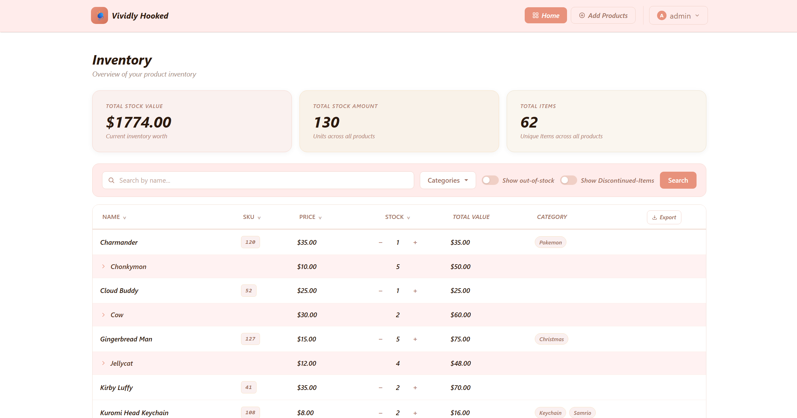
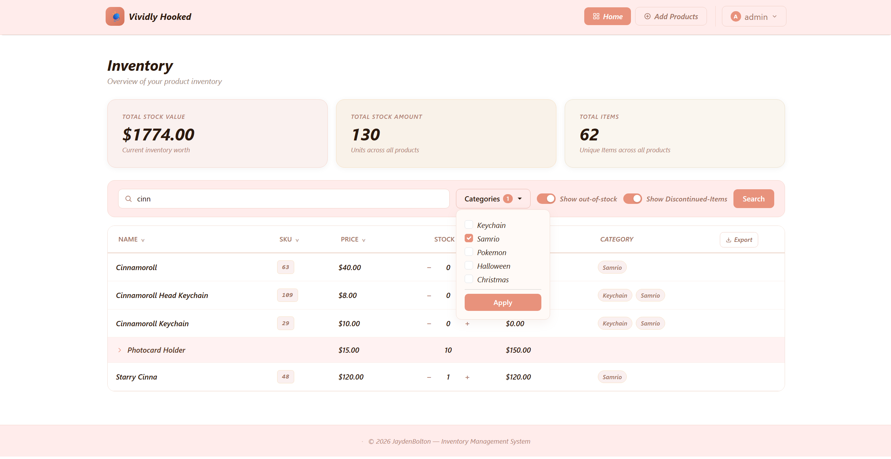
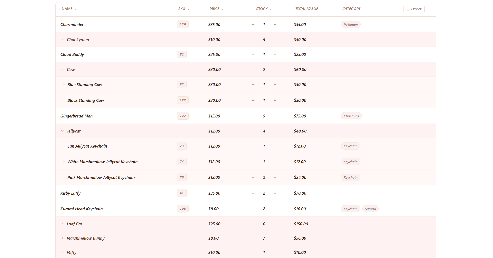
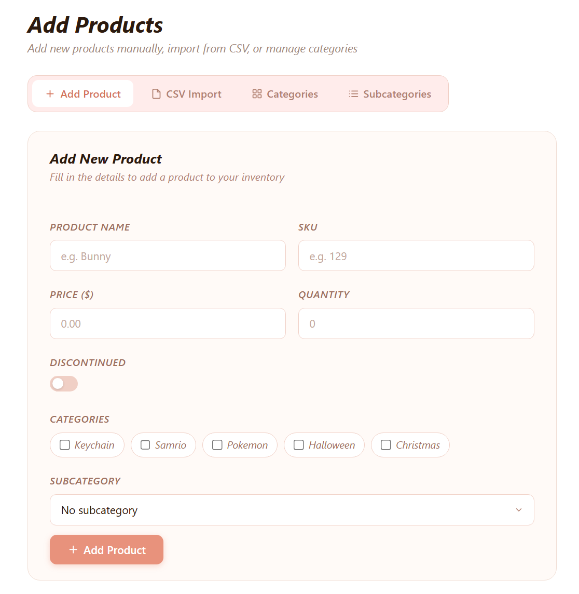

# Inventory Management System

A full-stack inventory management system built with Django that allows users to manage products, track stock levels in real time, and organize inventory using categories and subcategories.

This project was developed independently to demonstrate backend data modeling, frontend interactivity, and full-stack integration in a practical, real-world scenario.

---

## 🌐 Live Demo

🔗 **Live Application:** https://inventory-management-7aa1.onrender.com/ 

### Demo Test Account 

- **Username:** Test
- **Password:** 12Test34

---

##  Project Background

This system was originally built for a small crochet business, with features tailored to how the user manages their inventory in real life.

Several design decisions reflect these specific requirements:

- **Integer-based SKU system** to allow easy sorting and quick identification of products  
- **Flexible category and subcategory structure** to organize differnet coloured products, and categorys like keychains
- **Highly personalized UI styling**, including a bold color palette, to match the user's brand and preferences  

Rather than being a generic inventory system, this project focuses on solving practical problems for an individual user, which influenced both the functionality and design choices.

---

## Features

### Inventory Management
- Create, edit, and manage products
- Track stock quantities and pricing
- Mark items as discontinued

### Real-Time Stock Updates
- Increment/decrement stock without page refresh
- Uses JavaScript (Fetch API) with Django backend
- UI updates instantly after server response

### Advanced Filtering & Search
- Search products by name
- Filter by **multiple categories**
- Toggle:
  - Out-of-stock items
  - Discontinued items
- Filters persist across sorting

###  Sorting System
- Sort by:
  - Name
  - SKU
  - Price
  - Stock quantity
- Supports ascending and descending order
- Maintains filters during sorting

### Subcategory Grouping
- Products grouped under subcategories
- Collapsible rows for better organization
- Aggregated values displayed per subcategory

### Derived Data
- Total inventory value
- Total stock count
- Per-product total value (price × stock)
- Subcategory-level aggregations

### Custom UI/UX
- Fully custom styling using CSS variables
- Responsive layout (mobile-friendly table behavior)
- Visual indicators:
  - Discontinued items
  - Category tags
- Auto-dismissing alerts with user interaction override

---

## Tech Stack

### Backend
- Python
- Django
- Django ORM
- PostgreSQL 

### Frontend
- HTML (Django Templates)
- CSS 
- JavaScript (Simple ui/ux enhansments)
- Bootstrap 

### Deployment
- Render (web hosting)
- Neon (serverless PostgreSQL database)

---

## Database Design

### Tables
- **Product**
- **Category**
- **SubCategory**

### Relationships
- A **Product** can belong to multiple **Categories** (Many-to-Many)
- A **Product** belongs to one **SubCategory** (Foreign Key)
- A **SubCategory** contains multiple **Products**

### Data Integrity
- Database-level constraints ensure:
  - Price ≥ 0
  - Stock ≥ 0
  - SKU ≥ 0

### Derived Properties
- Product total value (`price × stock`)
- Subcategory:
  - Total stock
  - Total value
  - Min/max price range

---

##  How It Works

### Filtering & Sorting
- Uses query parameters (`GET`) to handle filtering and sorting
- State is preserved across interactions (e.g., filtering + sorting together)

### Combined Data Rendering
- Products and subcategories are merged into a single dataset
- Allows grouped display with collapsible UI behavior

### Real-Time Updates
- Stock buttons trigger asynchronous requests to the backend
- Django processes the update and returns JSON
- Frontend updates:
  - Stock values
  - Subcategory totals
  - Dashboard summary cards

---

## Screenshots

### Dashboard

### Filtering & Search

### Subcategory View

### Add/Edit Product

---

## ⚠️ Notes

- This project was built independently as a learning and portfolio project
- Code comments are written primarily for personal clarity and understanding
- Some implementation decisions prioritize readability and learning over production-level optimization

---

## Future Improvements

- **Authentication Enhancements**
  - Add email verification for new accounts  
  - Implement secure password reset functionality  

- **Market Mode (Live Sales Tracking)**
  - Track sales in real-time during events or markets  
  - Display live metrics such as total revenue and items sold  
  - Provide a dedicated interface for managing active sales sessions  

- **Market History & Reporting**
  - Store completed market sessions for future reference  
  - Generate insights such as:
    - Revenue per event  
    - Product performance  
    - Sales trends over time  
  - Compare performance across multiple markets  

- **Automated Inventory Updates**
  - Deduct sold quantities from stock after each market session  
  - Keep inventory accurate without manual adjustments 
---
